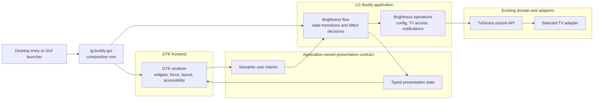

# LG Buddy GUI Target Architecture

This document defines the target frontend architecture for the first-party
Linux GUI. It anchors the brightness MVP in
[#127](https://github.com/Staphylococcus/LG_Buddy/issues/127) and the later GUI
increments under
[#22](https://github.com/Staphylococcus/LG_Buddy/issues/22).

This is a target-state document, not a description of the current Zenity
implementation. For the architecture that exists today, see
[Architecture overview](architecture-overview.md).

## Decisions

1. GTK 4 is the first-party renderer.
2. The application owns one typed, toolkit-neutral declaration for each
   screen and accepts semantic user intents in return.
3. The GTK layer contains no business logic or consequential effects.
4. The GUI calls the Rust application in-process. It does not communicate
   through CLI output, a daemon, HTTP, or a serialized UI protocol.
5. CLI and service paths remain headless and do not link GTK.
6. GTK uses standard controls, system typography, system colors, native
   focus behavior, and accessibility semantics with minimal custom styling.
7. The declaration vocabulary stays small and specific to LG Buddy. It is not
   a general-purpose widget toolkit.

The central distinction is between declaring what the user can currently see
and do, and deciding what those actions mean. The application owns both the
declaration and the meaning. GTK only realizes the declaration using native
widgets and translates widget events back into semantic intents.

## Migration Baseline

The current `brightness` prompt path in `commands.rs` is a useful behavioral
baseline, but not the target boundary:

| Current implementation | Target state |
| --- | --- |
| `BrightnessUi` exposes one blocking prompt and an error dialog | The application publishes state and accepts intents over time |
| `ZenityBrightnessUi` shells out to `zenity` | GTK renders typed application declarations |
| `CurrentExeBrightnessCli` shells back into `lg-buddy brightness get/set` | The GUI process calls an in-process brightness application operation |
| The prompt wrapper owns reachability, read fallback, notifications, and orchestration together | Those decisions live in an explicit application flow behind the presentation contract |
| Tests fake the prompt, nested CLI, ping, and notification collaborators | Application tests drive state and operations directly; renderer tests consume presentation fixtures |
| Cucumber substitutes a Zenity executable | A thin display-backed smoke covers the real GTK launch boundary |

The migration should preserve observable product behavior unless the MVP issue
explicitly changes it. It should not preserve the subprocess structure merely
because current tests encode that structure.

## Target Boundary



The arrows define the dependency direction:

- presentation types belong to the application, not GTK
- GTK depends on those types
- application and domain code do not depend on GTK
- GTK does not call TV, config, settings, notification, or service modules
- the composition root may construct both sides but contains no product
  decisions

## Target Repository Shape

The smallest useful compile-time boundary is a separate GUI binary crate:

```text
crates/lg-buddy/
  src/
    presentation/
      mod.rs
      brightness.rs
    ...existing application, domain, and adapter modules...

crates/lg-buddy-gui/
  Cargo.toml
  src/
    lib.rs
    main.rs
    brightness.rs
```

`crates/lg-buddy` remains the GTK-free library and CLI/service binary. It owns
the presentation contracts, state transitions, dependency construction, and
operations. Its normal tests must continue to build on a host without GTK
development packages.

`crates/lg-buddy-gui` owns the libadwaita application and window shell, GTK
widgets, renderer, and main-loop bridge. Libadwaita supplies the native GNOME
appearance and system color-scheme integration; product presentation remains
application-owned. It depends on `lg-buddy`, GTK, and libadwaita, never the
reverse. The GUI crate should consume one public application entrypoint rather
than assembling TV or configuration dependencies itself.

The installed graphical executable is `lg-buddy-gui`. The desktop entry launches
that executable directly. The user-facing `lg-buddy brightness` command may
locate and launch it for compatibility, while `lg-buddy brightness get` and
`lg-buddy brightness set` remain direct headless commands. That launcher handoff
does not become the frontend/backend contract: once `lg-buddy-gui` starts, GTK
and the application communicate only through in-process Rust types.

This split also keeps GTK runtime linkage out of systemd services and the
headless CLI. Release bundles and packages must ship the GUI executable and
declare its real GTK runtime dependencies separately from the existing CLI
binary.

The headless binary may retain its current static musl release target. The GTK
binary is a separate dynamically linked Linux artifact built against the
oldest supported GNU/GTK baseline. The release bundle must identify and verify
both artifacts; the GUI must not force the service and CLI binary to adopt its
linkage model. The exact minimum GTK and GNU ABI versions are release and
packaging decisions validated on supported distribution baselines.

## Presentation Contract

### Screen-specific declarations

The contract starts with concrete screen models. The brightness MVP should not
begin with a generic tree of rows, widgets, properties, callbacks, or stringly
typed component names.

A representative contract shape is:

```rust
pub struct BrightnessPresentation {
    pub title: String,
    pub status: BrightnessStatus,
    pub control: Option<BrightnessControl>,
    pub primary_action: ActionPresentation,
    pub cancel_action: ActionPresentation,
}

pub struct BrightnessControl {
    pub label: String,
    pub current: OledBrightness,
    pub proposed: OledBrightness,
    pub minimum: u8,
    pub maximum: u8,
    pub step: u8,
    pub enabled: bool,
}

pub enum BrightnessStatus {
    Loading,
    Ready,
    Applying,
    Failed(UserFacingError),
}

pub struct ActionPresentation {
    pub label: String,
    pub enabled: bool,
    pub intent: BrightnessIntent,
}

pub struct UserFacingError {
    pub summary: String,
    pub detail: Option<String>,
}
```

This is semantic data, not a GTK widget tree:

- `BrightnessControl` means “let the user propose a bounded brightness value,”
  not “construct this exact slider with these pixels.”
- each action declares its intent and availability without choosing a GTK
  widget hierarchy or asking the renderer to infer what a label means.
- `BrightnessStatus` tells the renderer what state exists without exposing a
  transport error or asking the renderer to infer policy.
- copy is plain text. GTK markup and widget-specific properties do not cross
  the boundary.

The renderer chooses the standard GTK representation for each semantic role.
Shared presentation primitives should be extracted only after another screen
needs the same semantics. Similar appearance alone is not enough reason to
create a generic abstraction.

### Semantic intents

GTK returns only intents that express what the user requested:

```rust
pub enum BrightnessIntent {
    Propose(u8),
    Apply,
    Retry,
    Cancel,
}
```

`Propose` carries the raw bounded-control value so the application remains the
only layer that validates it into `OledBrightness`. The renderer does not turn
`Apply` into a TV call, decide whether retry is allowed, or close the window
because a callback happened to succeed. The application handles the intent and
publishes the next presentation or an explicit close outcome.

Window-close requests map to `Cancel`. Programmatic widget changes must not
create accidental user intents. The GTK adapter may suppress signal feedback
while applying a presentation; that is rendering mechanics, not business
logic.

### Application outcomes

The application publishes a closed set of outcomes to the host:

```rust
pub enum BrightnessFrontendUpdate {
    Present(BrightnessPresentation),
    Close,
}
```

The contract is internal and typed. It is not serialized or independently
versioned. The backend and frontend change atomically in the workspace, and
the Rust compiler enforces contract compatibility.

If a later requirement needs an external process boundary, that is a separate
architecture decision. It must not be anticipated by adding identifiers,
schema versions, JSON, or transport errors to this contract.

## Application Ownership

The brightness application flow owns:

- configuration loading and validation
- construction of the selected TV client
- reachability policy, if retained
- reading and validating the current brightness
- fallback or recovery behavior when the read fails
- the proposed value and whether Apply is available
- the loading, ready, applying, failed, and completed transitions
- prevention of duplicate or stale operations
- cancellation semantics
- error normalization and recovery actions
- the TV write and its postcondition behavior
- success or failure notifications
- diagnostics and exit status

The GTK layer owns only:

- selecting standard GTK widgets for the declared semantic roles
- widget creation, placement, sizing, and responsive layout
- rendering application-provided text and state
- focus order, keyboard accelerators, and mnemonic wiring
- accessibility roles, labels, descriptions, and relationships
- routing widget signals to semantic intents
- presenting or closing the window when instructed
- respecting system font, scale, color, and theme settings

GTK callbacks must not:

- parse configuration or command output
- construct a TV client or call `TvDevice`
- perform a ping or other reachability check
- validate, clamp, or silently replace a brightness value
- decide when an action is enabled
- translate transport failures into user messages
- retry, notify, persist, log product outcomes, or control services
- branch on domain errors to choose the next workflow state

Simple renderer assertions that protect toolkit invariants are allowed. For
example, receiving an invalid declared range should fail a renderer test rather
than be repaired with a second set of product rules.

## Brightness Flow

The application flow is an explicit state machine even if its implementation
remains small:

| Current state | Input | Application responsibility | Next presentation |
| --- | --- | --- | --- |
| Opening | application start | begin the current-value operation | Loading |
| Loading | read succeeds | store current and proposed value | Ready |
| Loading | read fails | apply the defined recovery or fallback policy | Ready or Failed |
| Ready | `Propose(value)` | validate and store the proposal | Ready |
| Ready | `Apply` | capture the proposal and start one write | Applying |
| Applying | write succeeds | record success and complete notification policy | Close or completed state |
| Applying | write fails | normalize the failure and expose recovery | Failed |
| Failed | `Retry` | retry the application-defined operation | Loading or Applying |
| Any open state | `Cancel` | cancel or detach safely without writing new state | Close |

The exact current product behavior should be preserved while moving it behind
this boundary unless #127 explicitly changes it. In particular, cancellation
must not write TV state, and `brightness get` and `brightness set` retain their
existing CLI contracts. Existing reachability, read-fallback, and notification
behavior must be treated as application policy during migration, never copied
into GTK.

An operation result is accepted only for the operation instance that is still
current. A late completion after cancel, retry, or shutdown cannot reopen the
window, overwrite a newer proposal, or report success for the wrong request.

## Main Loop And Blocking Work

GTK objects stay on the GTK main thread. TV discovery, connection, pairing,
reads, writes, subprocess compatibility calls, and network checks never run in
a GTK signal callback or otherwise block the main loop. This follows GTK's
[threading model](https://docs.gtk.org/gtk4/section-threading.html).

The target event path is:

1. A GTK signal is translated into a `BrightnessIntent`.
2. The application accepts or rejects the intent from its current state.
3. Any blocking application effect runs on a worker owned by the application
   host.
4. Its typed completion returns to the application state machine.
5. The application publishes a new `BrightnessFrontendUpdate`.
6. The GTK main loop renders that update.

The chosen channel or executor is an implementation detail. It must provide a
bounded, shutdown-safe path and must not leak GLib or GTK types into
`crates/lg-buddy`. Only one brightness effect is in flight at a time. The
application remains authoritative even when the renderer has already disabled
a button.

## GTK Rendering Rules

The MVP should look like a normal GTK utility rather than introduce an LG
Buddy-specific widget language or theme.

| Declared meaning | GTK responsibility |
| --- | --- |
| Screen title | Application window title and visible heading where appropriate |
| Brightness percentage | Standard bounded adjustment control with a visible value |
| Loading or applying | Standard busy indication and insensitive affected controls |
| Primary action | Standard button using the declared label and enabled state |
| Cancel | Standard secondary action and window-close behavior |
| Failure | Standard inline error/status presentation with declared recovery action |

Renderer rules:

- use GTK widgets before custom widgets
- use natural sizing and standard spacing rather than fixed pixel layouts
- preserve visible labels and logical focus order
- make the full flow keyboard-operable
- expose accessible names, descriptions, values, and relationships
- do not encode state using color alone
- follow the active system theme and scaling
- avoid custom CSS unless a concrete GTK limitation requires it
- keep platform chrome, focus visuals, animation, and control behavior under
  GTK ownership

The minimum GTK API level must be selected from the oldest supported Linux
distribution baseline, not from the newest API available on a development
machine. Raising that baseline belongs with packaging validation.

## Error, Cancellation, And Shutdown Semantics

Domain and adapter errors remain typed inside the application. Before a failure
crosses the presentation boundary, the application converts it into safe,
actionable text and declares which recovery intents are available. The
renderer never displays debug representations or searches error strings.

Secrets, access tokens, and unredacted protocol payloads must not enter a
presentation type. Detailed diagnostics may be logged through the existing
application diagnostics path, while the presentation receives only the detail
needed by the user.

Closing the window emits `Cancel`; it is not permission for the renderer to
kill a worker or assume that an operation was undone. The application decides
whether a pending operation can be cancelled, must be detached, or has already
completed. Shutdown closes intent/update channels cleanly, ignores obsolete
completions, and never leaves a GTK callback waiting for a worker.

Failure to initialize GTK or connect to a graphical session is a launcher
failure. It should produce a concise diagnostic and nonzero exit status without
changing the headless CLI behavior.

## Contract Testing Strategy

The GUI follows the repository's three-layer
[testing strategy](testing-strategy.md). The majority of behavior remains
testable without GTK.

### 1. Module behavior: application presentation and state

Pure or narrowly injected tests in `crates/lg-buddy` cover:

- the initial Loading declaration
- successful current-value loading
- the defined read-failure recovery or fallback
- proposal changes and Apply availability
- invalid values being rejected before presentation
- Apply producing exactly one operation
- duplicate Apply being ignored while busy
- success, write failure, retry, and cancellation transitions
- late operation completions being ignored
- safe user-facing error normalization
- GTK-free construction and equality of every presentation state

These tests assert semantic state and emitted effects, not widget classes,
pixels, screenshots, or callback order.

### 2. Module interoperability: application operations and renderer contract

Application integration tests use injected brightness operations and the
existing TV test boundaries to prove that intents reach the real application
path without invoking the CLI as a subprocess. They cover configuration,
selected TV adapters, pairing/recovery, current-value reads, writes,
notifications, and representative failures at the abstraction that owns each
behavior.

The GTK crate has a reusable renderer contract suite. It feeds representative
`BrightnessPresentation` fixtures into the renderer and observes the semantic
surface:

- the expected controls, labels, values, status, and enabled states exist
- focus order and keyboard activation are correct
- accessible roles, names, values, and descriptions are present
- widget signals emit exactly the corresponding `BrightnessIntent`
- applying a new presentation does not emit accidental intents
- busy, failure, retry, scaling, and light/dark theme states remain usable

Renderer tests use application-owned fixtures; they do not rebuild the state
machine in a GTK fake. A display-backed CI lane may provide the GTK environment,
but TV and network dependencies remain mocked at their existing boundaries.

### 3. User needs: thin graphical journey

A small acceptance layer proves only the user-visible boundary:

- the desktop entry opens the brightness window without a terminal
- the current value becomes visible
- changing and applying a value reaches the application once
- cancellation performs no write
- an unreachable TV or failed write leaves actionable feedback
- the window remains responsive during blocking TV work

Release-bundle smoke proves that both executables, the desktop entry, and the
required GTK runtime dependencies are present. It should not duplicate the
application state-machine matrix.

Screenshots may support design review, but they are not the primary contract:
system themes, fonts, and rendering legitimately vary. Automated assertions
should prefer semantic controls, accessibility state, and user intents.

Real TV testing remains targeted. It is required only when a change claims
different visible TV behavior or when the existing mock contract is unclear;
ordinary renderer work must not require hardware.

### Contract matrix

| Contract | Owner | Primary proof |
| --- | --- | --- |
| Presentation and intent semantics | `lg-buddy` application | GTK-free module tests |
| State transitions and effect decisions | `lg-buddy` application | Pure/injected state-machine tests |
| TV operation behavior | Existing TV domain and adapters | Existing unit, protocol, and characterization tests |
| Application-to-operation wiring | `lg-buddy` application | Integration tests with injected dependencies |
| Semantic declaration to GTK mapping | `lg-buddy-gui` renderer | Reusable renderer contract suite |
| Desktop launch and runtime dependencies | Packaging/release surface | Display-backed bundle smoke |
| Visible TV outcome | Product boundary | Selected acceptance and hardware checks |

No test should need to mock a contract below the layer under test when a
shared repository harness already represents that boundary.

## Implementation Method

The MVP moves toward the target in independently reviewable, observable
slices. Implementation details remain acceptance criteria within the slice
that first needs them:

1. [#140](https://github.com/Staphylococcus/LG_Buddy/issues/140) opens the GTK
   window from an application-owned Loading declaration and establishes the
   crate, renderer, lifecycle, and display-backed test boundaries.
2. [#141](https://github.com/Staphylococcus/LG_Buddy/issues/141) retrieves and
   displays the current brightness, establishing backend-to-frontend state
   flow and the non-blocking operation boundary.
3. [#142](https://github.com/Staphylococcus/LG_Buddy/issues/142) lets the user
   apply brightness, establishing semantic intents and frontend-to-backend
   state flow.
4. [#143](https://github.com/Staphylococcus/LG_Buddy/issues/143) routes the
   existing desktop and interactive CLI touchpoints to the GTK window.
5. [#144](https://github.com/Staphylococcus/LG_Buddy/issues/144) integrates the
   GUI with install, upgrade, and removal behavior.
6. [#145](https://github.com/Staphylococcus/LG_Buddy/issues/145) ships the GUI
   in release bundles and adds installed-artifact smoke coverage.

Each slice must leave the existing `brightness get`, `brightness set`, service,
and compatibility paths green. The Zenity implementation remains available in
the v1.5.0 slice; removing it is tracked separately by
[#130](https://github.com/Staphylococcus/LG_Buddy/issues/130).

## Evolution Rules

Later GUI areas follow the same method:

- add a screen-specific application declaration and semantic intents
- keep navigation and multi-step workflow state in the application
- reuse domain operations rather than CLI strings
- add GTK-free contract/state tests first
- implement GTK mapping and its renderer contract tests second
- extract a shared semantic presentation type only after genuine reuse appears
- change the application contract and every renderer atomically

A frontend change that requires GTK to understand config keys, TV transports,
service commands, update rules, or migration policy indicates that the
application contract is missing a semantic state or intent. Fix the contract
instead of teaching the renderer the rule.

## Non-goals

- a general-purpose declarative UI framework
- a serialized UI schema or runtime-loaded screen definition
- a custom theme, widget set, or design system
- a local daemon or frontend protocol
- moving existing domain or policy behavior into GUI code
- replacing the CLI or service entrypoints
- implementing settings, pairing, diagnostics, or first-run setup in the
  brightness MVP
- removing Zenity in the MVP

GTK templates or builder files may be used internally by the GTK renderer.
They are renderer implementation details and do not replace the
application-owned presentation contract.

## MVP Architectural Acceptance

The brightness MVP satisfies this architecture when:

- the core crate compiles and tests without GTK
- the GTK crate imports application presentation types but the core imports no
  GTK or GLib types
- GTK callbacks emit semantic intents and perform no TV, config, notification,
  service, validation, or workflow work
- blocking operations cannot stall the GTK main loop
- presentation states and transitions have complete GTK-free coverage
- the GTK renderer passes the shared semantic, keyboard, accessibility,
  scaling, and theme contract
- the desktop entry launches the GUI and the bundle supplies its runtime
  dependencies
- CLI, headless service behavior, and the retained Zenity compatibility path
  remain unchanged
