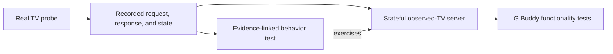

# Native webOS Testing

This document describes how LG Buddy tests its native webOS boundary.

It is implementation guidance, not an attempt to define a general webOS
emulator. The goal is to provide a reliable TV boundary for LG Buddy while
keeping every claimed device behavior traceable to real hardware evidence.

## Confidence Chain



Each step has a distinct responsibility:

- real-TV probes establish what the device actually does
- issue comments preserve the relevant request, response, starting state, and
  resulting state
- characterization tests state the behavior LG Buddy relies on and link to the
  evidence
- the stateful server centralizes observed webOS responses and transitions
- higher-level tests use that server to exercise LG Buddy behavior without
  reproducing webOS payloads

`bscpylgtv` remains useful as a source of hypotheses and compatibility clues.
It is not evidence that the native client or mock should copy without a real-TV
observation.

## Test Surfaces

### Stateful observed-TV server

`crates/lg-buddy/src/web_os/test_support/observed_tv.rs` owns normal webOS
behavior that has been observed on the test TV. This includes registration,
response payloads, permission checks, and state transitions such as:

- changing the foreground application after an input switch
- moving between `Active` and `Screen Off`
- moving to `Power Off` and rejecting an immediate new registration

The server validates the request URI and payload sent by the client before it
responds. Controls mutate server state, and later reads expose that state. This
lets tests verify an operation through an independent observation instead of
only accepting its immediate acknowledgement.

The server should fail when a test asks for an unobserved URI, input, permission
failure, or state combination. Unsupported behavior is intentionally visible;
the mock must not invent a plausible response to make a test pass.

Normal observed response JSON belongs in this server. Tests may assert domain
values and error details that matter to LG Buddy, but should not create a second
scripted copy of the response fixture.

### Characterization tests

`crates/lg-buddy/src/web_os/observed_behavior.rs` exercises the real native
client against the stateful server. These tests define the device contract that
LG Buddy currently relies on.

Each observed behavior test must include a comment linking to the issue or
issue comment that contains its hardware evidence. A useful test states:

- the initial TV state
- the native operation being performed
- the returned domain result or exact meaningful error
- the resulting state, preferably verified by a later read

Registration behavior may be characterized beside the authentication code when
that keeps token persistence and authentication events in the same test. It
must still use the centralized observed-TV server and link to its evidence.

### Scripted protocol tests

`ScriptedWebOsServer` and `ScriptedWebOsPeer` are for synthetic fault injection
and low-level protocol mechanics, including:

- malformed JSON or malformed payloads
- unrelated or incorrect response IDs
- timeouts and early connection closure
- deliberately rejected registration
- responses that contradict observed token behavior

They should not replay ordinary successful TV responses. If a scripted test
starts describing normal device behavior, that behavior belongs in the
stateful server and its characterization suite.

Pure parser tests remain appropriate for malformed, boundary, and forward-
compatibility cases. Their inputs are test cases for the parser rather than
claims about a real TV.

### LG Buddy functionality tests

Tests above the webOS module should use the stateful server when native TV
behavior is part of the scenario. These tests should focus on LG Buddy outcomes:
policy decisions, retries, state ownership, command results, and user-visible
behavior. They should not know the normal webOS wire response shape.

As the native client moves behind the TV domain boundary, the same server can
support tests of `TvDevice`, command orchestration, and acceptance scenarios.
The characterization suite remains responsible for documenting and guarding
the observed device contract represented by the server.

A passing mock-backed functionality test proves LG Buddy behavior against the
current device model. It is not evidence that an unverified device behavior is
real.

## Adding Or Refining Behavior

Use this sequence when implementing another native webOS operation or learning
about a device quirk:

1. Drive the operation manually against the real TV using the temporary
   `lg-buddy dev webos-auth-probe`, `lg-buddy dev webos-read-probe`, or
   `lg-buddy dev webos-control-probe <operation>` surface, or an equally narrow
   diagnostic.
2. Record the initial state, request, response, and resulting state in the
   relevant GitHub issue. Remove access tokens and other secrets.
3. Add or update an evidence-linked characterization test.
4. Extend the centralized stateful server only as far as the observation
   supports. Preserve exact quirks when LG Buddy behavior depends on them.
5. Add parser or synthetic fault tests for defensive behavior that cannot be
   claimed as an observation.
6. Use the refined server in the LG Buddy functionality tests for the new
   operation.
7. Run the focused webOS tests, then the normal workspace suite.

```bash
cargo test -p lg-buddy --lib web_os
cargo test --workspace
```

If later evidence contradicts the current model, update the evidence-linked
test and server together. Downstream functionality tests should inherit the
refined behavior without changing their own webOS fixtures.

## Transport Boundary

The observed-TV server uses local plain WebSocket transport so behavior tests
stay focused on registration, requests, responses, and state. TLS behavior is a
separate concern and is covered by the self-signed webOS WSS transport test.

Keeping these layers separate makes failures diagnostic: a characterization
failure points to device semantics, while a WSS test failure points to transport
setup.

## Review Checklist

For native webOS test changes, check that:

- every claimed device behavior has a hardware evidence link
- normal response fixtures have one home in the stateful server
- controls update state and are verified through a meaningful read when
  possible
- unobserved behavior fails clearly instead of being generalized
- scripted peers are limited to protocol mechanics or explicit fault injection
- higher-level LG Buddy tests assert domain outcomes rather than wire JSON
- access tokens and device-specific secrets are absent from fixtures and logs
